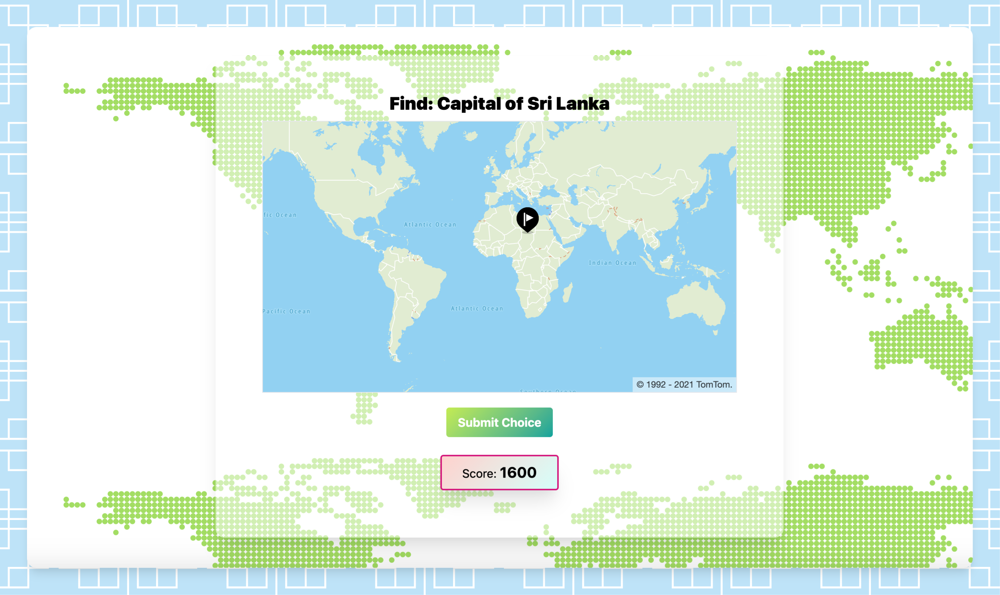
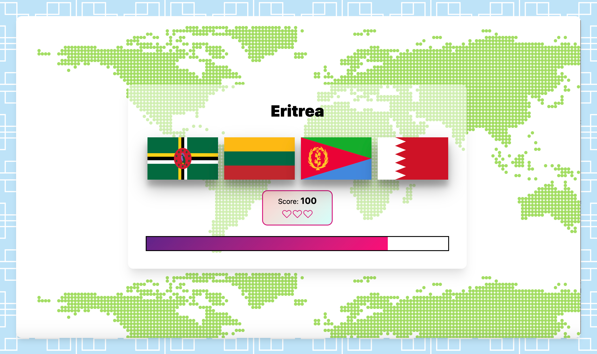
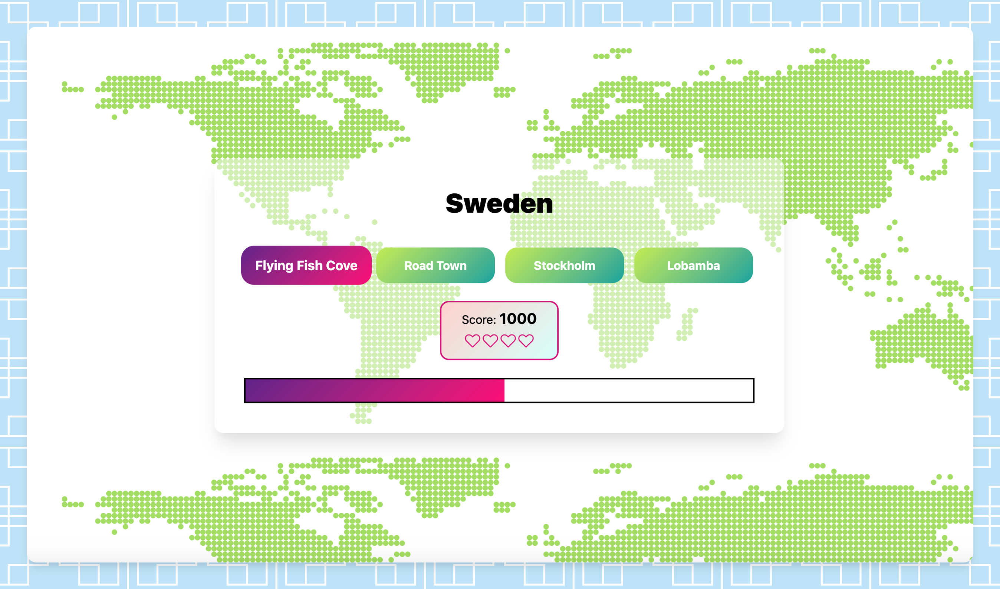
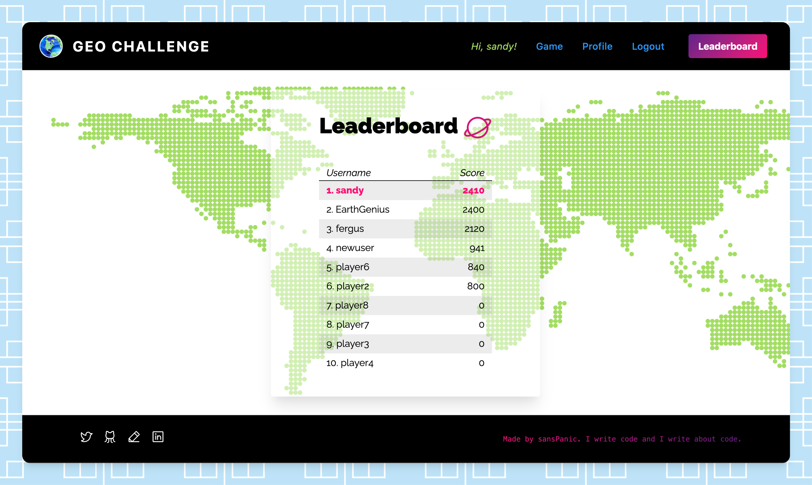

# GEO-CHALLENGE :world_map: :earth_africa:

Test your Geography knowledge in this game inspired by the FB Playfish classic GeoChallenge. Under time pressure, associate a country with its flag, its capital and find the country's location on the world map. 

## Technologies :woman_scientist:
#### Frontend
1. JavaScript
2. React, Create React App 
3. Jest
4. TailwindCSS
5. React-router-dom
6. Axios
7. Additional libraries for: icons, audio, unique key generation, maps integration (TomTom)

#### Backend
1. Node
2. Express
3. jsonschema
4. node-pg
5. jest
6. auth with jwts

## Features :palm_tree:
1. **3 interactive game levels** - guess the flag, guess the capital, guess the location
2.  Registration and authentication - 2 levels for guests, 3 for registered users
3. Leaderboard with highscores by registered users
4. 2 timed levels with speed bonus, 1 relaxed untimed level
5. Audio feedback 
6. Profile + user details update feature
7. Error handling in forms

## Approach :woman_student:
#### Frontend
1. Created reusable game components
2. GameWrapper component conditionally renders 3 levels or end-game, based on state
3. Game state, Auth state and Audio shared via Context 
2. Implemented client-side routing via react-router-dom switch component
3. Authentication via JWTs, localStorage used to enable user to persist between refreshes and browser closing/opening
5. Testing: smoke tests, snapshot tests and unit tests via Jest

#### Backend 
1. Auth achieved via JWT
2. jsonschema used for server-side validation of input
3. Backend stores user information as well as highscores

## For developers :octocat:

### Frontend

##### To run: `npm start` 

Runs the app in the development mode. Open [http://localhost:3000](http://localhost:3000) to view it in the browser. The page will reload if you make edits. Backend ([repo](https://github.com/sanspanic/geo-challenge-backend)) can be run on port 3001.

##### To run tests: `npm test` 
Launches the test runner in interactive watch mode.

##### To build for production: `npm run build` 
Builds the app for production to the `build` folder. It correctly bundles React in production mode and optimizes the build for the best performance. The build is minified and the filenames include the hashes.

### Backend

#### To start server: `node server.js`

Will start server on localhost 3001. 

#### To run tests: `npm test`

Will run all tests with coverage. 

## Screengrabs

